# System Map

Change summary:

- Reframed Human Engine as a deterministic physiological decision system, not just a backend pipeline.
- Split the map into source, storage, model, decision, delivery, feedback, and calibration layers.
- Marked each major layer as `implemented`, `partial`, `planned`, or `future` based on current docs and repo state as of 2026-05-20.

## 1. Executive overview

Human Engine is a deterministic training readiness and recovery system.

It solves one core problem:

> given mixed real-world training and recovery data, determine current physiological readiness and turn that into an explainable daily training decision

Why cross-ecosystem data matters:

- training load often lives in Strava and connected devices
- recovery signals often live in Apple Health / HealthKit
- the useful daily answer depends on both load and recovery, not one ecosystem alone
- preserving raw source data keeps the system explainable and recomputable as the model evolves

Core boundary:

- deterministic core first
- AI is auxiliary for explanation, formatting, and developer workflows
- AI does not define readiness, recovery, or recommendation logic

## 2. End-to-end system flow

```mermaid
flowchart LR
    A[Sources<br/>Strava<br/>Apple Health / HealthKit<br/>User profile<br/>Subjective feedback<br/>Future equipment<br/>Future calendar/context]
    B[Ingestion<br/>webhooks, full sync, API payloads]
    C[Raw storage<br/>immutable source payloads]
    D[Normalization<br/>source-specific tables]
    E[Derived metrics<br/>daily load, sleep, HRV, RHR, weight]
    F[State models<br/>LoadState + RecoveryState]
    G[Readiness<br/>daily deterministic score and explanation]
    H[Explanation<br/>structured factors, fallback mode, data quality]
    I[Recommendation<br/>deterministic decision layer]
    J[Briefing / UI<br/>API, Telegram, iOS, future Today screen]
    K[Feedback<br/>RPE, next-day recovery, future pre-ride input]
    L[Calibration / validation<br/>snapshots, analytics, offline research]

    A --> B --> C --> D --> E --> F --> G --> H --> I --> J
    J --> K --> L
    G --> L
    I --> L
```



ASCII view:

```text
sources
-> ingestion
-> raw storage
-> normalization
-> derived metrics
-> state models
-> readiness
-> explanation
-> recommendation
-> briefing / UI
-> feedback
-> calibration / validation
```

## 3. Data sources

### Implemented

- Strava: workout/activity ingestion and daily load inputs
- Apple Health / HealthKit: sleep, HRV, resting HR, weight via full-sync payloads
- User profile: present in product scope and docs, used as a required input family for training interpretation, but not yet documented as a fully mature layer
- Subjective feedback: Telegram-based post-ride RPE and next-day recovery collection

### Partial

- User profile / athlete profile: documented in product scope, but not yet a clearly isolated, mature production layer

### Planned

- Equipment data: bike, components, maintenance state for ride preparation
- Calendar and daily context data: discussed in product direction for time-aware recommendations and morning briefings

### Future

- Additional device or equipment ecosystems beyond current Strava + Apple Health bridge

## 4. Backend layers

### API layer

Status: `implemented`

- FastAPI backend is the system entry point
- exposes sync, recompute, readiness read, notification/debug, callback paths, and the internal SSR dashboard route
- current repo evidence:
  - `backend/backend/app.py`
  - `backend/backend/dashboard/`
  - `backend/backend/templates/dashboard/`
  - readiness API docs in `docs/api/READINESS_API.md`

### Ingestion layer

Status: `implemented`

- Strava webhook + ingest jobs
- HealthKit full-sync ingest and orchestration
- feedback callback ingestion for Telegram prompts

### Raw tables

Status: `implemented`

- raw source payloads are preserved for reproducibility
- current documented/raw entities include:
  - `strava_webhook_event`
  - `strava_activity_ingest_job`
  - `strava_activity_raw`
  - `healthkit_ingest_raw`

### Normalized tables

Status: `implemented`

- source payloads are normalized into explicit tables rather than used directly in product logic
- current normalized tables include:
  - `health_sleep_night`
  - `health_resting_hr_daily`
  - `health_hrv_sample`
  - `health_weight_measurement`

### Derived metric tables

Status: `implemented`

- `daily_training_load`
- `health_recovery_daily`
- other per-day derived fields embedded in recovery and readiness explanation payloads

### Readiness / recovery / load state

Status: `implemented`

- `load_state_daily_v2`
- `health_recovery_daily`
- `readiness_daily`

### Recommendation layer

Status: `partial`

- deterministic recommendation and briefing logic exists in backend code and readiness API responses
- current implementation is still a narrow readiness-to-zone mapping, not a full ride preparation system
- important separation:
  - readiness calculates physiological state
  - recommendation maps state into action guidance

### Notification / briefing layer

Status: `partial`

- Telegram daily readiness delivery exists
- Telegram post-ride and next-day recovery prompts exist
- readiness briefing exists as deterministic text formatting
- broader multi-surface morning briefing orchestration is still incomplete

### Observability

Status: `implemented`

- structured JSON logs
- Docker stdout -> Promtail -> Loki -> Grafana
- observability is operational only and must not become product logic

## 5. Storage and processing model

```text
external source payloads
-> raw immutable tables
-> normalized source tables
-> derived daily aggregates
-> state materializations
-> decision and delivery outputs
-> outcome / feedback storage
-> calibration analytics and research exports
```

Current storage examples by layer:

- Raw:
  - `strava_activity_raw`
  - `healthkit_ingest_raw`
- Normalized:
  - `health_sleep_night`
  - `health_resting_hr_daily`
  - `health_hrv_sample`
  - `health_weight_measurement`
- Derived:
  - `daily_training_load`
  - `health_recovery_daily`
- State:
  - `load_state_daily_v2`
  - `readiness_daily`
- Feedback / evaluation:
  - `activity_subjective_feedback`
  - `subjective_feedback_prompt_log`

Design intent:

- raw data is preserved
- normalized and derived layers are explicitly separated
- state models are recomputable from stored upstream layers
- feedback is stored as outcome evidence, not as a silent modifier of production logic

## 6. Model layers

### LoadState

Status: `implemented`

Materialized in:

- `load_state_daily_v2`

Current role:

- models training load accumulation and decay on a continuous calendar axis
- exposes `fitness`, `fatigue_fast`, `fatigue_slow`, `fatigue_total`, `freshness`

### RecoveryState

Status: `implemented`

Materialized in:

- `health_recovery_daily`

Current role:

- converts sleep, HRV, resting HR, and weight-derived context into a daily recovery contour
- stores both the aggregate score and explanation payload

### Readiness

Status: `implemented`

Materialized in:

- `readiness_daily`

Current role:

- combines `LoadState` and `RecoveryState`
- remains separate from raw freshness and separate from downstream recommendation

Current baseline formula:

```text
freshness_norm = clamp(50 + freshness, 0, 100)
readiness_score_raw = 0.6 * freshness_norm + 0.4 * recovery_score_simple
readiness_score = clamp(round(readiness_score_raw, 1), 0, 100)
```

### GoodDayProbability

Status: `implemented baseline`

- stored in `readiness_daily`
- current mapping is:

```text
good_day_probability = readiness_score / 100
```

Important constraint:

- this is not yet a calibrated statistical probability
- it is a probability-like presentation layer over readiness

### Confidence / freshness / data quality

Status: `partial`

- `data_quality` already appears in readiness API responses
- fallback modes are already explicit in explanation payloads
- freshness of sync and confidence semantics are important, but not yet formalized as one coherent production model

This is a cross-cutting concern, not a separate model:

- source freshness affects trust in the answer
- data completeness affects fallback mode
- continuity gaps affect interpretation
- future calibration quality depends on storing this context explicitly

### Recommendation / decision layer

Status: `partial`

- currently implemented as deterministic mapping and briefing templates
- should remain downstream from readiness
- must not recalculate physiology or silently blend in AI reasoning

Current implemented basis:

- recommendation zones from readiness score
- rule-based explanation strings
- briefing text for readiness API and Telegram

Still missing for a fuller production decision system:

- explicit decision objects with richer constraints
- stable freshness/confidence-aware recommendation policy
- integrated ride preparation context such as equipment and calendar

## 7. Product loops and scenario epics

The current scenario-epic framing is the best product-level view of the system.

### 7.1 Morning Readiness Loop

Status: `partial`

System map slice:

- HealthKit sync
- normalization
- recovery recompute
- load state continuity
- readiness recompute
- freshness-aware daily delivery

Current state:

- core recompute path exists
- morning answer exists
- freshness-aware delivery/orchestration is not yet complete

### 7.2 Explainable Readiness Experience

Status: `partial`

System map slice:

- `readiness_daily`
- explanation payloads
- `data_quality`
- deterministic recommendation reason
- history API for trend context

Current state:

- explanation structure exists
- Today screen UX is documented
- final compact multi-surface explanation experience is still incomplete

### 7.3 Ride Preparation and Recommendation Loop

Status: `partial`

System map slice:

- readiness
- deterministic recommendation
- ride briefing
- future equipment/context constraints

Current state:

- baseline recommendation and briefing exist
- broader ride preparation layer is still not implemented as a full system

### 7.4 Post-Workout Feedback Loop

Status: `implemented baseline`

System map slice:

- activity ingestion
- Telegram RPE prompt
- next-day recovery prompt
- prompt log
- subjective feedback storage

Current state:

- feedback storage and prompt orchestration exist
- additional surfaces and richer flows remain planned

### 7.5 Readiness Calibration Loop

Status: `partial`

System map slice:

- readiness snapshots
- recommendation context snapshots
- subjective outcomes
- analytics joins
- validation exports

Current state:

- the feedback dataset layer exists
- calibration as reproducible analytics is the next step
- production decision logic is not auto-adapting from feedback

### 7.6 Research Sandbox

Status: `future`

System map slice:

- offline dataset export
- experimentation
- model comparison
- research-only validation

Constraint:

- research remains separate from production decision logic
- no hidden online ML loop should be introduced into readiness or recommendation

Note on GitHub issues `#91-#96`:

- direct issue metadata was not accessible from this environment during this update
- this section therefore uses the current repo-local scenario-epic proposal as the source of truth

## 8. UI and delivery surfaces

### iOS app

Status: `partial`

- iOS is part of the documented product flow and HealthKit ingestion architecture
- Today/readiness UX is documented in `docs/ui/READINESS_TODAY_SCREEN.md`
- the repo currently contains the Xcode project shell but not committed Swift source files, so repo-visible implementation is incomplete

### Telegram bot / notifications

Status: `implemented baseline`

- daily readiness notifications
- post-ride RPE prompt
- next-day recovery prompt
- callback-based feedback collection

### Future Today screen / morning briefing

Status: `planned`

- freshness-aware morning answer
- sync status visibility
- explicit stale/missing-data handling

### Internal dashboard

Status: `implemented baseline`

- current route: `/dashboard`
- served as FastAPI SSR HTML with Jinja2 templates and minimal CSS
- current sections: `System`, `Strava` placeholder, `Ingest Jobs` placeholder, `Connection` placeholder, `System Info` placeholder
- `System` currently exposes backend status, database status, server time, process start time, uptime, and database error fallback
- database errors must not break page rendering
- dashboard remains internal and is not yet production-secure without auth

### Future dashboards

Status: `planned` / `future`

- product dashboards for readiness history, calibration summaries, or research views are discussed indirectly in docs
- current dashboards are operational observability dashboards, not product analytics surfaces

## 9. Feedback and calibration

Why feedback is collected:

- readiness and recommendation need downstream ground truth
- deterministic state alone does not reveal whether the athlete actually felt good, overreached, or recovered well
- repeated low-friction observations are required for validation

Current feedback families:

- post-ride RPE
- next-day recovery
- future pre-ride subjective readiness

How these relate to calibration:

- RPE helps evaluate perceived training cost
- next-day recovery helps evaluate delayed recovery impact
- subjective readiness can later be compared with system-predicted readiness

Why feedback does not directly mutate the model:

- production readiness must remain deterministic and reproducible
- feedback is currently an observed outcome layer
- calibration should produce explicit research or rule-change decisions, not hidden online adaptation

What must be stored for future validation:

- feedback value and normalized score
- feedback type and source
- activity/date linkage
- readiness snapshot at feedback time
- recommendation snapshot at feedback time
- model version
- data quality / fallback context when available
- prompt delivery state for longitudinal collection quality

## 10. Observability and operations

### Structured logs

Status: `implemented`

- backend emits JSON logs with stable event names
- examples include API, HealthKit sync, readiness recompute, and error events

### Grafana / Loki

Status: `implemented`

- Promtail parses backend logs
- Loki stores/indexes logs
- Grafana is the operational view for traces, event timelines, durations, and failures

### Pipeline diagnostics

Status: `implemented baseline`

- HealthKit full-sync start/finish and payload processing events
- readiness recompute events
- request tracing via request IDs
- feedback prompt delivery persistence in `subjective_feedback_prompt_log`

### Future validation jobs

Status: `planned`

- explicit calibration joins
- dataset export validation
- mismatch detection and model-version comparisons

Important boundary:

- observability explains system behavior
- observability does not define readiness or recommendation logic

## 11. Current gaps

- Recommendation layer is only partially implemented as a readiness-to-zone mapping plus briefing templates; it is not yet a full ride preparation engine.
- Data confidence, freshness, and trust semantics are important but not yet formalized into one consistent production model.
- HealthKit background or event-driven sync reliability is still a product/implementation gap; current docs emphasize freshness and sync-state work as active scope.
- `good_day_probability` exists, but it is not yet a calibrated probability model.
- Calibration is not production ML; current feedback storage supports validation, not online adaptation.
- Research Sandbox remains future-only and should stay offline and review-gated.
- iOS product surface is only partially visible in the repo; docs and the Xcode project exist, but committed app source is not currently present.

## 12. Simplification rule

Any future addition should fit this chain:

```text
source -> raw -> normalized -> derived -> state -> readiness -> decision -> delivery -> feedback -> calibration
```

If a proposed feature bypasses this chain, it should be challenged:

- does it belong in deterministic production logic
- is it actually a delivery concern
- is it calibration/research instead of state computation
- is it trying to hide a model change behind AI or UI wording
